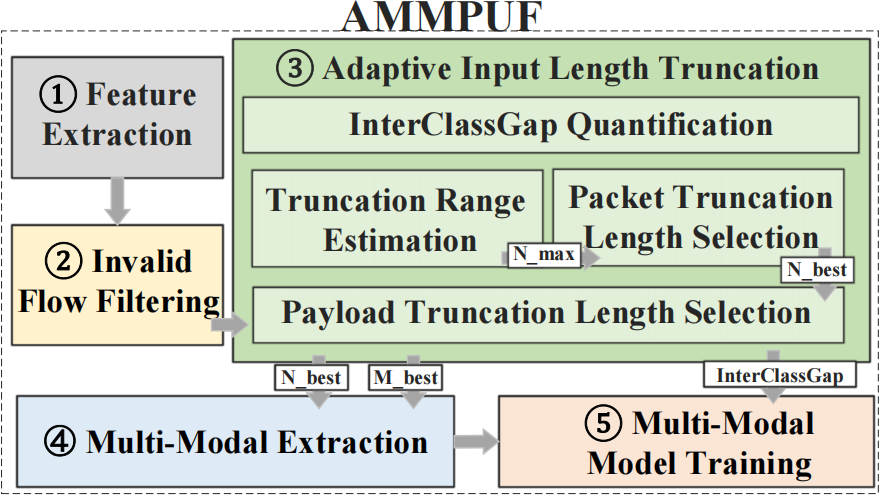
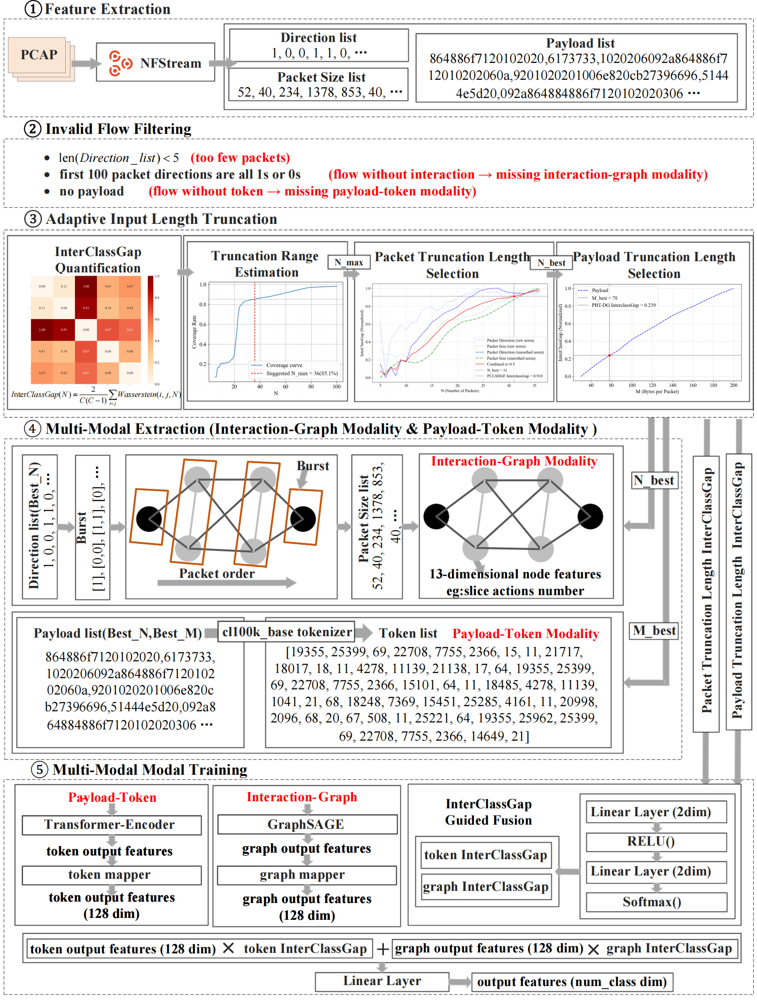

# Deep Thinking on Information Exploitation: An Adaptive Multi-Modal Classification Approach for Encrypted Traffic

Encrypted traffic classification is a fundamental networking task, benefiting the detection of Web intrusions, maintenance of service quality, and so on. For this task, the exploitation of traffic information is the cornerstone, however, it is largely overlooked in existing studies.
Specifically, information exploitation derives two critical challenges: (I)How to choose suitable features from different categories and represent them into distinguishable schema (i.e., modality construction); (II) How to adaptively extract the minimal amount while ensuring sufficient information for learning and classifying (i.e., quality optimization). The majority of current works rely on single-modality features and manually pick the amount of extracted information via expert experience, resulting in unsatisfying performance and a non-automated process.
To tackle these issues, this work systematically analyzes the information exploitation of encrypted traffic, revealing three impactful characteristics: modality heterogeneity, information density heterogeneity, and discriminative information positional heterogeneity.
Building on these insights, we propose AMMPUF, an adaptive and multi-modal method integrating interaction behaviors and payload byte sequences.
We design an adaptive truncation strategy that dynamically optimizes input length for improved feature quality, and further introduce a flexible fusion mechanism guided by inter-class distance to support modality integration.
Experiments demonstrate that AMMPUF outperforms the comparisons in achieving better classification

The flowchart of AMMPUF is as follows.

## Model Architecture

Below is the schematic representation of the AMMPUF model:

*For detailed information, methodologies, and specific experiment results, we encourage readers to consult our paper.*
